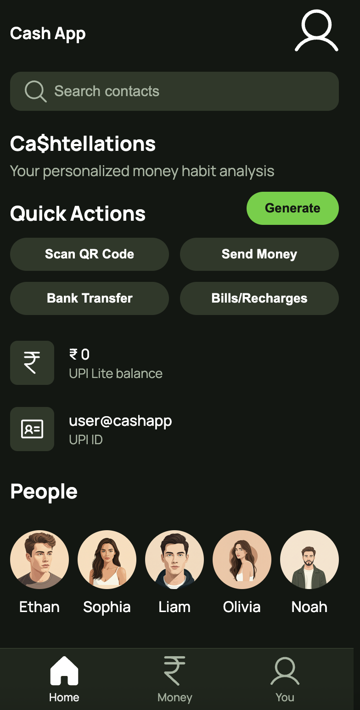

# Figma to Code Demo

This project demonstrates the use of the Gemini CLI to convert a Figma design into a functional HTML, CSS, and JavaScript prototype.

## The Mockup



## The Result (The Prototype)

The `figma_prototype` directory contains the generated web prototype. To view it, open `figma_prototype/index.html` in your browser.

## How it Works (A High-Level Overview)

This prototype was generated using the Gemini CLI by following these general steps:

1.  **Configure MCP Servers:** The `.gemini/settings.json` file is configured to use specific Model Context Protocol (MCP) servers. These servers act as bridges between the Gemini CLI and external services.
    *   **`context7`**: Provides the model with up-to-date documentation and code examples for various libraries and frameworks.
    *   **`Framelink Figma MCP`**: A local server that connects the Gemini CLI to the Figma API, allowing it to analyze design files and extract layout, styling, and asset information.

2.  **Analyze Design:** The process starts by analyzing the Figma design file to understand its structure, components, and styles.

3.  **Generate Code:** Based on the analysis, the initial HTML, CSS, and JavaScript files are generated.

4.  **Download Assets:** All necessary image assets are downloaded directly from the Figma file and placed in the `assets` directory.

5.  **Refine & Verify:** The generated code is then refined to ensure it accurately matches the mockup.

## Running the React Prototype

To run the interactive React prototype:

1.  Navigate to the `figma_prototype_react` directory:
    ```bash
    cd figma_prototype_react
    ```

2.  Install the dependencies:
    ```bash
    npm install
    ```

3.  Start the development server:
    ```bash
    npm start
    ```

This will open the application in your default web browser.

For a more detailed breakdown, please refer to the upcoming blog post.